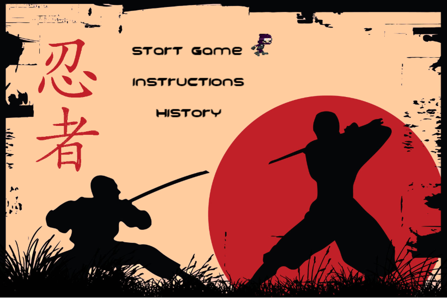
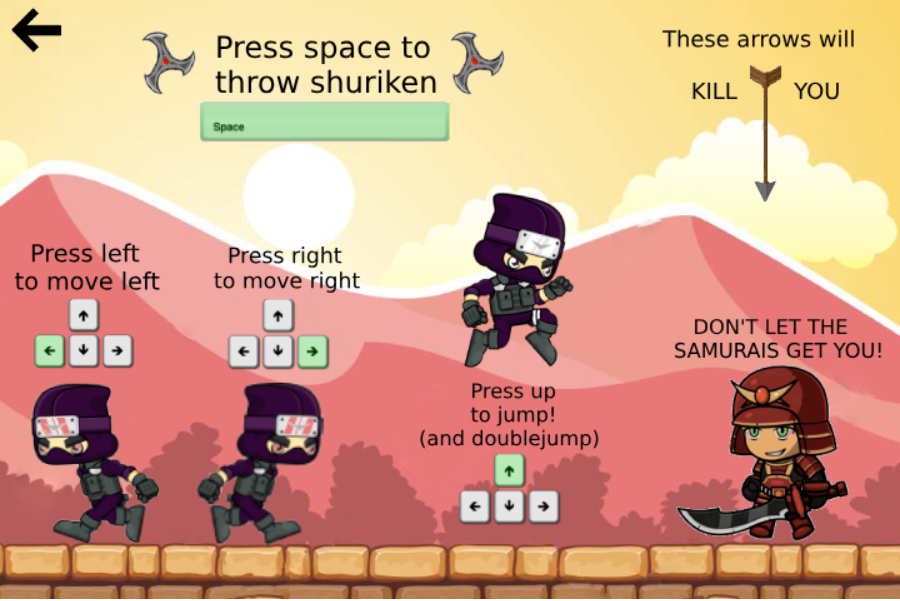
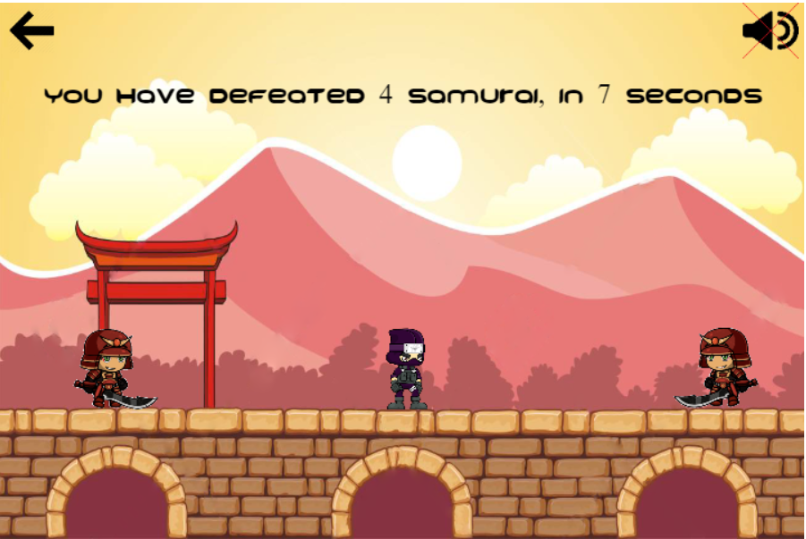

<h1>
Ninja Fighter
</h1>
   
  </a></a>
 
 
Ninja Fighter is a 2d game made with canvas, you can try it out <a href="https://havardp.no/ninjaFighter">here! <a/>

---

## Motivation

This game was part of a web development project in my first semester. To try it out simply clone the project and use the `index.html` file, or click on the link above. The objective of the game is simply to survive as long as possible, and kill the incoming samurai with shurikens.

